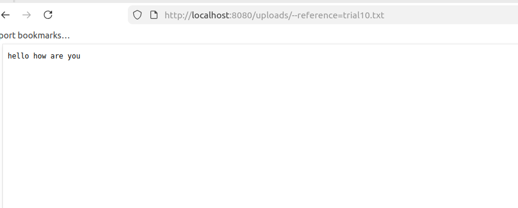
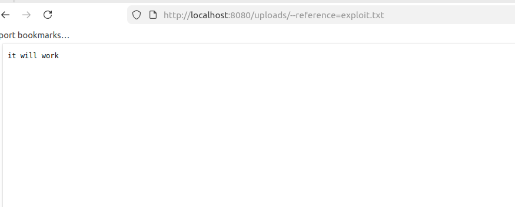
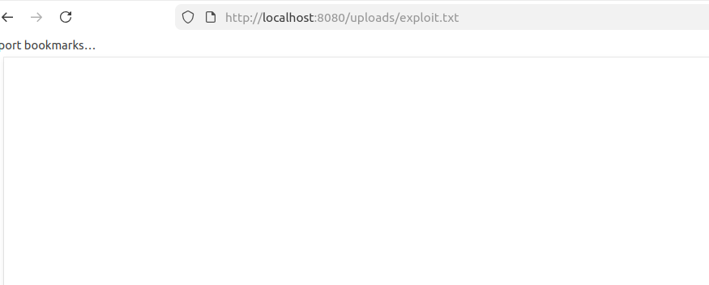
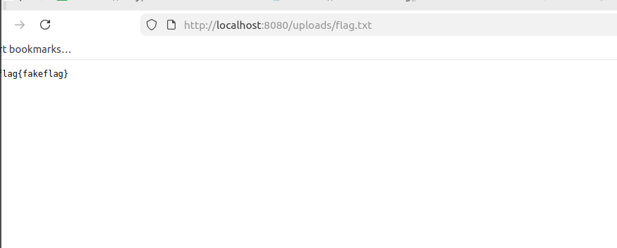

# challenge 
this is a web explotation where we need to know the different applications of chmod

## flag
 flag{fakeflag}
 
## method 

- first step was that i examined the given php file and we read that and found that we can only upload .txt files and the permission on the file is chmod 000 *
- the file has a limit on the amount of content in the file.
- so we need to comeup with a script to bypass the permsiion apache after we upload the file.
- i tried a variety of stuff i uploaded the file and could not get file to show to me
- so i did man the instruction and found that --reference=trial.txt trial.txt being the name of the flag helped use pass the flag safely.
- not exaclty pass the flag but like not see that forbidened message

- now we upload a file with --reference=trail.txt because when we do this in like a normal setting we see that after the upload of trail.txt the file chmod make the permissions of the file to be changed. 

- we make the file settings of the pic change and see it being accepted

- so the flag has has the permissions changed and we can read the file

